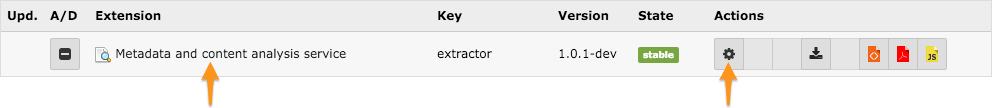
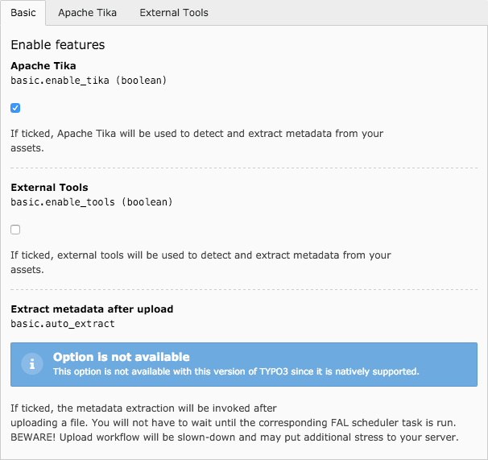
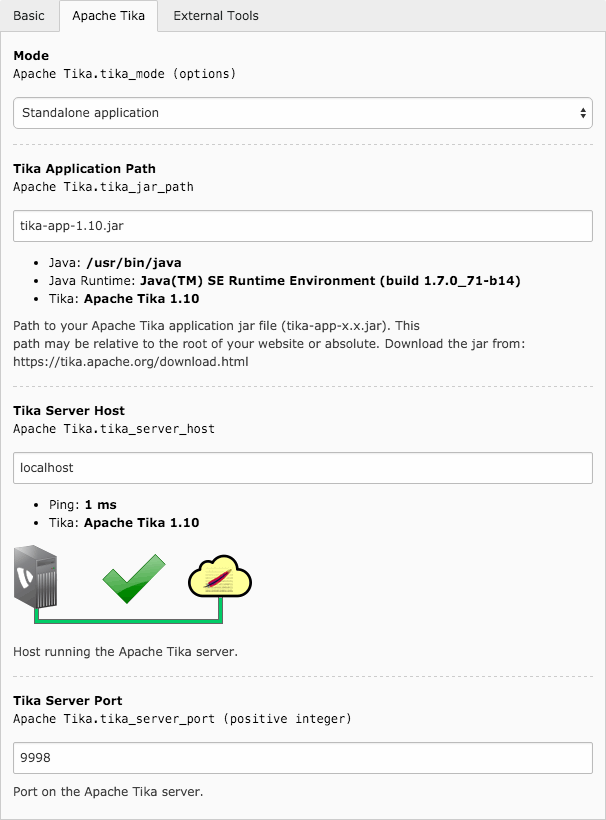
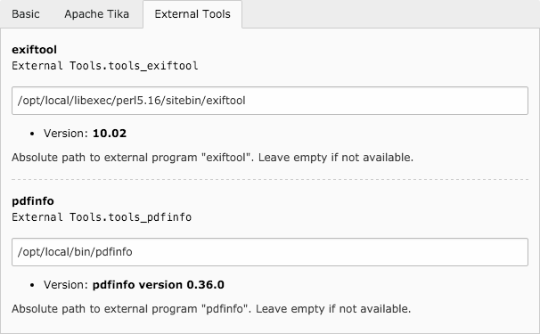

.. ==================================================
.. FOR YOUR INFORMATION
.. --------------------------------------------------
.. -*- coding: utf-8 -*- with BOM.

.. include:: ../Includes.txt

.. _admin-manual:

Administrator manual
====================

.. only:: html

	This chapter describes how to manage the extension from a superuser point of view.

.. _admin-manual-install:

Installing the extension
------------------------

There are a few steps necessary to install the Metadata and content analysis extension. If you have installed other
extensions in the past, you will run into little new here.

As usual, install the extension and load it using the Extension Manager. Then configure it by either clicking on the
gear icon or on the title of this extension.

    Click on the title or on the gear icon to configure the extension.

The tabs (see corresponding figures) let you configure the various settings of this extension.

    Basic settings to enable or disable the use of external tools or extract metadata on-the-fly when uploading a file
    (TYPO3 6.2 only since this is the case automatically since TYPO3 7).

    Settings for using Apache Tika (optional).

    Path to various external tools (optional).

Apache Tika
^^^^^^^^^^^

Using Apache Tika is highly recommended for best extraction results. You may use either the standalone application jar
or connect to an Apache Tika server. The latest should probably be quicker to answer since it run as a daemon.

Apache Tika may be downloaded from https://tika.apache.org/download.html.

**Connection to an Apache Tika Server**

When connecting to a server and not to the standalone Jar application, handy animations, in Extension Manager, will let
you easily double check that provided parameters are correct:

.. only:: html or json

    Successful connection
        .. image:: ../Images/animation_ok.gif
            :alt: Successful connection

    Broken connection
        .. image:: ../Images/animation_ko.gif
            :alt: Broken connection

.. only:: latex

    Successful connection
        .. image:: ../Images/connection_success.png
            :alt: Successful connection

    Broken connection
        .. image:: ../Images/connection_broken.png
            :alt: Broken connection

.. hint::
    If you are able to run Tika as a server, you will be able to extract metadata nearly instantaneously, whereas the
    same with the standalone application jar will typically result in a delay of a few seconds per file.

External Tools
^^^^^^^^^^^^^^

This extension is capable of using external tools to extract metadata:

- `exiftool <http://www.sno.phy.queensu.ca/~phil/exiftool/>`__ for files containing EXIF, IPTC / XMP metadata;
- `pdfinfo <http://linuxcommand.org/man_pages/pdfinfo1.html>`__ for PDF.
